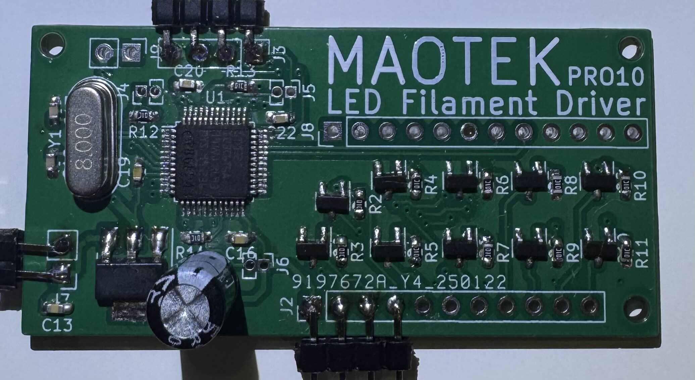

## LED Filament Driver

---

## Remarks

- KiCad project also contains a driver for EDP displays, however this schematic was not included in the final production PCB.
- Produced by JLCPCB.
- Crystal is not necessary for application not requiring precise timing.

---
## Issues

- Unfortunately, output 9 and 10 do not have PWM output. Will be fixed in the next revisions if any.
- AMS1117 3.3 is rated for 1A, make sure the LED filaments do no consume more than 1A. Otherwise they will overheat.
- For loads higher than 1A, consider buck converters.
